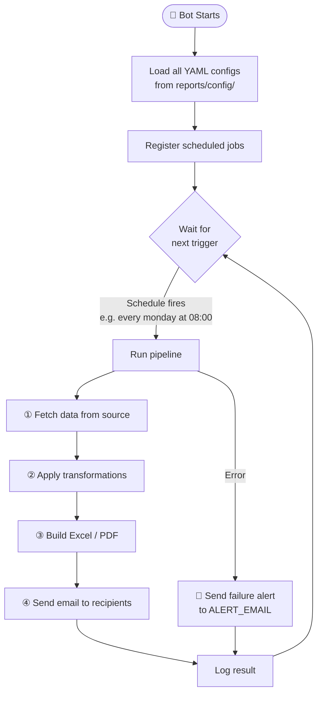
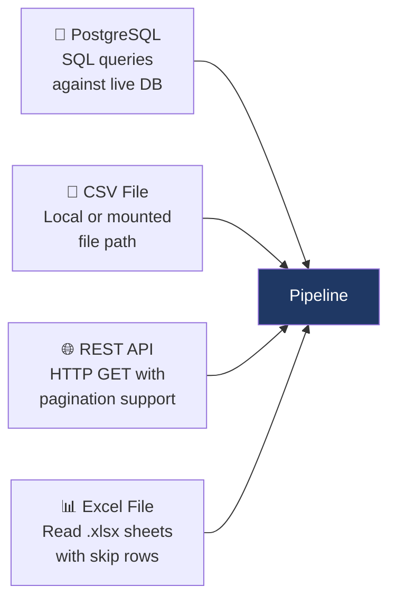
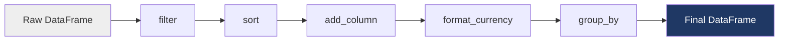

<div align="center">

# Automated Report Bot

**Pull data → Transform → Build → Deliver. Fully automated, zero human intervention after setup.**

[](https://www.python.org/)
[](https://www.docker.com/)
[](LICENSE)
[](tests/)

</div>

---

## What is this?

Automated Report Bot is a **no-code reporting engine**. You define reports as YAML files — what data to pull, how to transform it, and who receives it — and the bot handles the rest on a schedule.

No recurring manual work. No scripts to remember to run. Just configure once and reports arrive in inboxes automatically.

---

## How the System Works

### Pipeline Flow

Every report follows the same four-step pipeline:

```mermaid
flowchart LR
    subgraph SOURCES["① Data Source"]
        direction TB
        PG[(PostgreSQL)]
        CSV[CSV File]
        API[REST API]
        XLS[Excel File]
    end

    subgraph TRANSFORM["② Transform"]
        direction TB
        T1[Filter]
        T2[Sort]
        T3[Add Columns]
        T4[Group By]
        T5[Format Currency]
    end

    subgraph BUILD["③ Build Report"]
        direction TB
        EX[📊 Excel .xlsx]
        PDF[📄 PDF]
    end

    subgraph DELIVER["④ Deliver"]
        direction TB
        EMAIL[📧 Email]
        ALERT[🚨 Failure Alert]
    end

    SOURCES --> TRANSFORM --> BUILD --> DELIVER
```



### Scheduler Architecture

The bot reads all YAML files from `reports/config/` at startup and registers a job for each one:



### What a Report Looks Like

The bot generates styled Excel and PDF files and delivers them inside a branded HTML email:

```
┌─────────────────────────────────────────────────────────────┐
│  📧 EMAIL RECEIVED                                          │
│─────────────────────────────────────────────────────────────│
│  From:    reports@yourcompany.com                           │
│  To:      ceo@company.com, sales@company.com                │
│  Subject: Weekly Sales Report — May 15, 2026                │
│                                                             │
│  ┌─────────────────────────────────────────────────────┐   │
│  │ ██████████████████████████████████████████████████  │   │
│  │  AUTOMATED REPORT BOT          May 15, 2026         │   │
│  │██████████████████████████████████████████████████   │   │
│  │                                                     │   │
│  │  Hi team,                                           │   │
│  │                                                     │   │
│  │  Please find attached the weekly sales report.      │   │
│  │  The report file is attached to this email.         │   │
│  │                                                     │   │
│  │  ─────────────────────────────────────────────────  │   │
│  │  This report is generated automatically             │   │
│  │  (every monday at 08:00). Do not reply.             │   │
│  └─────────────────────────────────────────────────────┘   │
│                                                             │
│  📎 weekly_sales_report_20260515_080012.xlsx               │
└─────────────────────────────────────────────────────────────┘
```

### Generated Excel Report Structure

```
┌──────────┬──────────┬────────────┬────────────┬─────────────────┐
│  date    │  region  │  revenue   │   orders   │ avg_order_value  │
├──────────┼──────────┼────────────┼────────────┼─────────────────┤
│ 2026-05-15│ North   │ $48,320.00 │    142     │    $340.28       │
│ 2026-05-15│ South   │ $31,780.00 │     98     │    $324.29       │
│ 2026-05-14│ North   │ $29,100.00 │     87     │    $334.48       │
│ 2026-05-14│ East    │ $22,540.00 │     65     │    $346.77       │
│    ...   │   ...    │    ...     │    ...     │      ...         │
└──────────┴──────────┴────────────┴────────────┴─────────────────┘
  ↑ Sorted by revenue desc  ↑ Currency formatted  ↑ Calculated column
```

---

## Quick Start

**Option 1 — Python directly:**

```bash
cp .env.example .env          # fill in your credentials
pip install -r requirements.txt
python -m bot.main            # starts the scheduler
```

**Option 2 — Docker (recommended):**

```bash
cp .env.example .env          # fill in your credentials
docker compose up --build     # starts bot + PostgreSQL, seeds sample data
```

The bot will start, register all reports found in `reports/config/`, and wait for their schedules to fire.

---

## Adding a New Report

Create a YAML file in `reports/config/`. The scheduler picks it up automatically on next start — no code changes required.

```yaml
# reports/config/my_report.yaml

name: "Weekly Sales Report"
schedule: "every monday at 08:00"
format: "excel"          # excel | pdf | both

source:
  type: "postgres"       # postgres | csv | api | excel
  url: "${DATABASE_URL}"
  query: |
    SELECT date, region, SUM(total) AS revenue
    FROM orders
    WHERE order_date >= NOW() - INTERVAL '7 days'
    GROUP BY 1, 2

transform:
  - type: "add_column"
    name: "avg_order_value"
    formula: "revenue / orders"
  - type: "format_currency"
    columns: ["revenue", "avg_order_value"]
  - type: "sort"
    by: "revenue"
    ascending: false

delivery:
  recipients:
    - "ceo@company.com"
    - "team@company.com"
  subject: "Weekly Sales Report — {date_range}"
  body: "Please find attached the weekly sales report."
  attach_file: true
```

> **That's it.** Drop the file in the folder and restart the bot.

---

## Data Source Types

### Overview



### Configuration Reference

| Type       | Required keys                                            | Optional keys                           |
|------------|----------------------------------------------------------|-----------------------------------------|
| `postgres` | `url` or (`host`, `user`, `password`, `database`), `query` | `port` (default `5432`)               |
| `csv`      | `path`                                                   | `separator` (default `,`), `columns`   |
| `api`      | `url`                                                    | `token`, `data_key`, `params`, `paginate`, `page_param` |
| `excel`    | `path`                                                   | `sheet` (name or index), `skiprows`    |

### PostgreSQL

```yaml
source:
  type: "postgres"
  url: "${DATABASE_URL}"
  query: "SELECT * FROM sales WHERE date >= NOW() - INTERVAL '7 days'"
```

### CSV File

```yaml
source:
  type: "csv"
  path: "data/inventory.csv"
  separator: ","
```

### REST API

```yaml
source:
  type: "api"
  url: "https://api.example.com/v1/records"
  token: "${API_TOKEN}"
  data_key: "results"
  paginate: true
  page_param: "page"
```

### Excel File

```yaml
source:
  type: "excel"
  path: "data/report.xlsx"
  sheet: "Sheet1"
  skiprows: 0
```

---

## Transformations

Transformations are applied in order, one after the other. Chain as many as needed.



| Type              | What it does                                       | Key config                                        |
|-------------------|----------------------------------------------------|---------------------------------------------------|
| `filter`          | Keep rows matching a condition                     | `column`, `op` (`eq/ne/gt/lt/gte/lte/contains`), `value` |
| `sort`            | Order rows by a column                             | `by`, `ascending` (bool)                          |
| `add_column`      | Compute a new column using a formula               | `name`, `formula` (pandas eval)                   |
| `format_currency` | Format numbers as `$1,234.56`                      | `columns` (list), `symbol`                        |
| `rename`          | Rename columns                                     | `mapping` (`{old: new}`)                          |
| `drop_columns`    | Remove columns from output                         | `columns` (list)                                  |
| `group_by`        | Aggregate rows                                     | `by` (list), `agg` (`{col: func}`)                |
| `wow_change`      | Add week-over-week % change column                 | `column`                                          |
| `revenue_kpi`     | Collapse to a single-row KPI summary               | `column`                                          |
| `region_rank`     | Add a rank column per region                       | `column`                                          |

**Example — add a computed column then sort:**

```yaml
transform:
  - type: "add_column"
    name: "margin_pct"
    formula: "(revenue - cost) / revenue * 100"
  - type: "sort"
    by: "margin_pct"
    ascending: false
```

---

## Schedule Format Reference

```
every monday at 08:00        # once a week on Monday at 8 AM
every friday at 17:00        # once a week on Friday at 5 PM
every day at 06:00           # every day at 6 AM
every 1 hours                # every hour
every 30 minutes             # every 30 minutes
```

Supported day names: `monday` `tuesday` `wednesday` `thursday` `friday` `saturday` `sunday` `day`

---

## Email Delivery

### Option A — SMTP (Gmail, Outlook, any server)

```env
SMTP_HOST=smtp.gmail.com
SMTP_PORT=587
SMTP_USER=you@gmail.com
SMTP_PASS=your-app-password
FROM_EMAIL=you@gmail.com
```

> For Gmail, generate an **App Password** at [myaccount.google.com/apppasswords](https://myaccount.google.com/apppasswords) — do not use your regular password.

### Option B — SendGrid (recommended for production)

```env
USE_SENDGRID=true
SENDGRID_API_KEY=SG.xxxxx
FROM_EMAIL=reports@yourdomain.com
```

### Failure Alerts

If a pipeline fails, the bot automatically sends an alert:

```env
ALERT_EMAIL=admin@company.com
```

```
┌─────────────────────────────────────────────────────────────┐
│  📧 FAILURE ALERT                                           │
│─────────────────────────────────────────────────────────────│
│  Subject: [ALERT] Report failed: Weekly Sales Report        │
│                                                             │
│  Report Weekly Sales Report failed.                         │
│                                                             │
│  could not connect to server: Connection refused            │
│  Is the server running on host "db" (172.18.0.2) and       │
│  accepting TCP/IP connections on port 5432?                 │
└─────────────────────────────────────────────────────────────┘
```

---

## Running with Docker

```bash
# 1. Configure credentials
cp .env.example .env

# 2. Start everything (bot + PostgreSQL, auto-seeds sample data)
docker compose up --build

# 3. Stream logs
docker compose logs -f bot

# 4. Stop
docker compose down
```

The PostgreSQL database is seeded automatically via `db/init.sql` with sample sales data so you can test the weekly report immediately.

---

## Running Tests

```bash
pip install -r requirements.txt
pytest tests/ -v
```

```
tests/test_sources.py       ✓  CSV, API, Excel source adapters
tests/test_transformers.py  ✓  All transformation types
tests/test_builders.py      ✓  Excel and PDF output
tests/test_pipeline.py      ✓  End-to-end pipeline run
```

---

## Project Structure

```
automated-report-bot/
│
├── bot/
│   ├── sources/              # Data source adapters (postgres, csv, api, excel)
│   ├── transformers/         # Data transformation steps
│   ├── builders/             # Excel (.xlsx) and PDF report builders
│   ├── delivery/
│   │   ├── email.py          # SMTP + SendGrid delivery
│   │   └── templates/
│   │       └── report_email.html   # Branded HTML email template
│   ├── scheduler.py          # Reads configs and registers cron jobs
│   ├── config.py             # YAML config loader + env var interpolation
│   ├── pipeline.py           # Orchestrator: fetch → transform → build → deliver
│   └── main.py               # Entry point
│
├── reports/config/           # Drop YAML files here to define reports
│   ├── weekly_sales.yaml
│   ├── monthly_summary.yaml
│   └── inventory_alert.yaml
│
├── data/                     # Seed CSV files for local testing
├── db/                       # SQL init scripts for Docker PostgreSQL
├── tests/                    # Pytest test suite (15+ tests)
├── output/                   # Generated report files (git-ignored)
│
├── Dockerfile
├── docker-compose.yml
├── requirements.txt
└── .env.example
```

---

## Environment Variables

| Variable           | Description                               | Default          |
|--------------------|-------------------------------------------|------------------|
| `DATABASE_URL`     | SQLAlchemy PostgreSQL connection URL      | —                |
| `SMTP_HOST`        | SMTP server hostname                      | `smtp.gmail.com` |
| `SMTP_PORT`        | SMTP port                                 | `587`            |
| `SMTP_USER`        | SMTP username                             | —                |
| `SMTP_PASS`        | SMTP password / app password              | —                |
| `FROM_EMAIL`       | Sender address shown to recipients        | `SMTP_USER`      |
| `USE_SENDGRID`     | Set `true` to use SendGrid instead        | `false`          |
| `SENDGRID_API_KEY` | SendGrid API key                          | —                |
| `ALERT_EMAIL`      | Address that receives pipeline failures   | —                |
| `OUTPUT_DIR`       | Directory where generated files are saved | `output`         |
| `CONFIG_DIR`       | Directory the scheduler scans for YAMLs  | `reports/config` |
| `LOG_LEVEL`        | Python logging level                      | `INFO`           |

---

<div align="center">

Built with Python · Runs anywhere Docker runs · Zero recurring manual work

</div>
